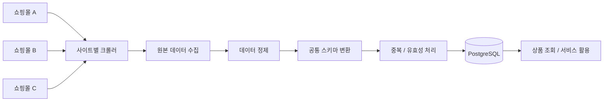

#  PC 부품 크롤링 서비스

> 구조가 서로 다른 여러 쇼핑몰에서 PC 부품 정보를 수집하고, 공통 기준으로 정제·통합하여 PostgreSQL에 저장하는 데이터 수집 서비스

---

##  프로젝트 목적

쇼핑몰마다 페이지 구조와 상품 정보 표현 방식이 다르기 때문에  
여러 사이트의 PC 부품 데이터를 그대로 비교하거나 활용하기 어렵습니다.

이 프로젝트는 사이트별 크롤러를 통해 상품 정보를 수집한 뒤,  
**서로 다른 데이터를 하나의 공통 기준으로 정제·통합하여 DB에 저장하는 구조**를 만드는 것이 목적입니다.

단순 크롤링에 그치지 않고 **수집 → 정제 → 통합 → 저장**의 데이터 처리 흐름을 구현하는 것을 목표로 합니다.

---

## 🛠 기술 스택

| 구분 | 기술 | 사용 목적 |
|---|---|---|
| 언어 | Python | 크롤러 및 데이터 처리 로직 구현 |
| 동적 페이지 수집 | Selenium | JavaScript 기반 페이지 및 동적 요소 처리 |
| HTML 파싱 | BeautifulSoup | 상품 정보 추출 |
| 데이터베이스 | PostgreSQL | 정제된 상품 및 판매 정보 저장 |
| 환경 관리 | dotenv / requirements | 설정값 및 패키지 관리 |

---

##  시스템 구성

### 구성 흐름

**쇼핑몰 → 사이트별 크롤러 → 데이터 수집 → 정제·통합 → PostgreSQL → 서비스 활용**

- **Crawler**: 사이트별 HTML 구조에 맞춰 상품 정보 수집
- **Normalizer**: 상품명, 가격, 제조사 등 데이터를 공통 기준으로 정제
- **Database**: 정제된 상품과 판매 정보를 PostgreSQL에 저장
- **Service**: 저장된 데이터를 이후 검색·비교 등의 기능에서 활용

---
